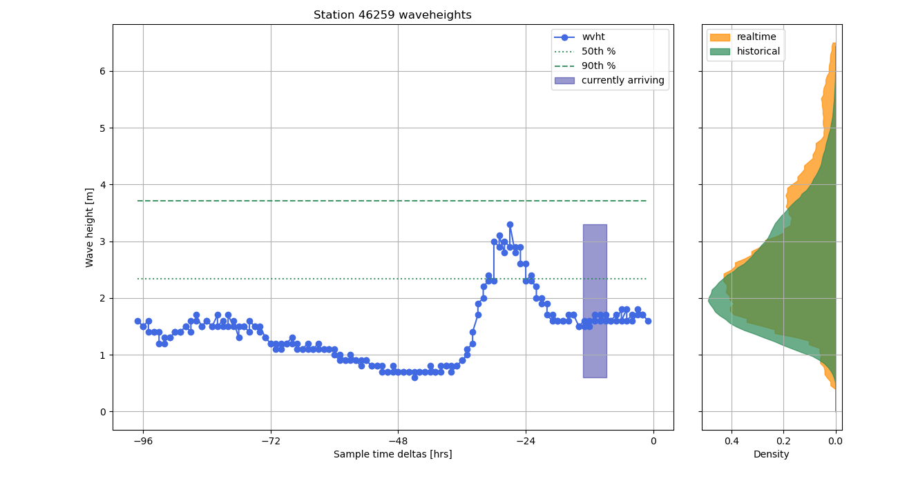
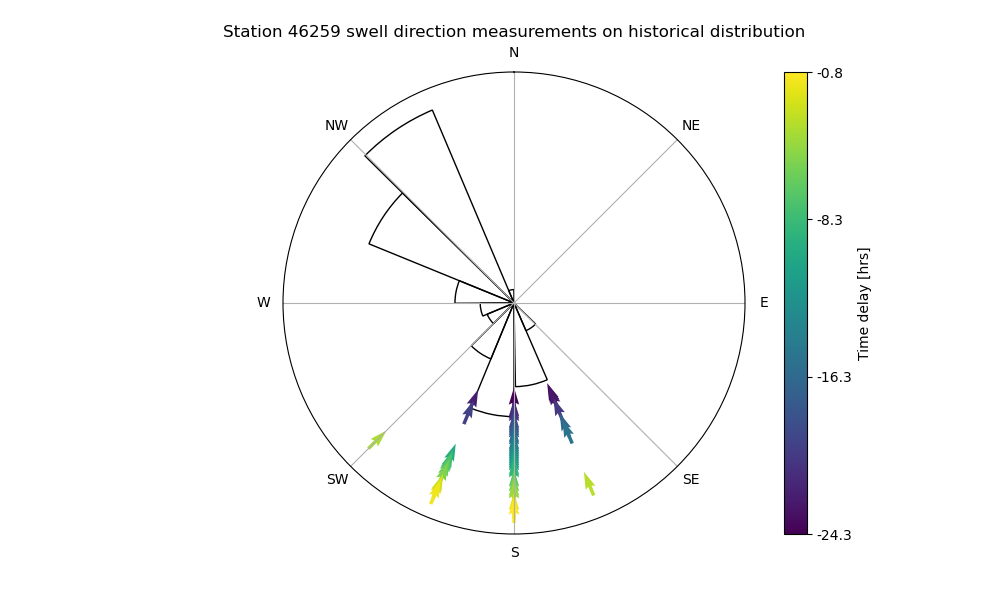

## Conda Package Manager

`conda env create -f CondaInstallEnvironment.yml`

## Example Usage

This project contains lots of scripts that analyze and plot the current/recent buoy readings, as well as scripts that exclusively look at measurements from prior years. 
First, we can run SwellMapMaker.py to produce a map of the desired buoys containing various metrics on the current swell readings (see [Example Visualizations](#example-visualizations)). 
An example call to this script looks like:

`python PlotSwellMap.py --bf buoy_files\ExampleBOI.txt --lat 32.96 --lon -117.23`

We can also run PlotWvhtDistributions.py to look at how recent wave height measurements compare to an estimate of the historical distribution (see [Example Visualizations](#example-visualizations)).
An example call to this script looks similar:

`python PlotWvhtDistributions.py --bf buoy_files\ExampleBOI.txt --lat 32.96 --lon -117.23`

Note that you can use the `--show` flag to display the plots instead of saving them in the code directory.

Please reference the [project google doc](https://docs.google.com/document/d/1HXEw0J6tvZzVh7JCB2amuyUP60e3Qw9Z17ZvJnnqDZo/edit?usp=sharing) for examples outputs and brief descriptions of the various analyses.

## Visualizing Historical Measurements

Many of the included analysis scripts focus solely on illustrating the historical measurements at a particular station.
For instance, PlotHistoricalWvhts.py produces a time series of different percentile wave heights for each month:

`python PlotHistoricalWvhts.py --bf buoy_files\ExampleBOI.txt --nYears 3 --show --minPeriod 12.0`

## Choosing Buoys of Interest

The ExampleBOI.txt file in the buoy_files folder contains station ID's for a set of NDBC buoys. 
Navigate to the [NDBC webpage](https://www.ndbc.noaa.gov) and hover over station icons to get their ID's.
Then build your own BOI text file and point your analysis to it.

Note that there are different types of stations included on the NDBC map.
Some of them do not have realtime wave measurement capabilities.
In these cases, you will get an exception stating that there was a 404 status code.

## MySQL Database

In order to minimize the number of requests made to the NDBC webpage, the analysis is configured to support writing to and reading from a MySQL database.
See the editDBTables.py file for the expected table structure and to intialize those tables. 
Reference the sample_config.py file for the variable expected in the database config file and make sure that you import the correct config file!

Once the database is configured, we add data to it using the UpdateSwellDB.py script. We use the same script to update the real-time and historical data for our desired stations.
Here is an example call to UpdateSwellDB.py:

`python ndbc_analysis_utilities\UpdateSwellDB.py --bf buoy_files\ExampleBOI.txt`

Provided the database is updated, we can set the `--db` flag on our analysis scripts in order to query the database for station data instead of the NDBC webpage. 
For example:

`python PlotWvhtDistributions.py --bf buoy_files\ExampleBOI.txt --lat 32.96 --lon -117.23 --db`

## Example Visualizations

## Resources

- [Project Google Doc](https://docs.google.com/document/d/1HXEw0J6tvZzVh7JCB2amuyUP60e3Qw9Z17ZvJnnqDZo/edit?usp=sharing)

- [NDBC home page](https://www.ndbc.noaa.gov)

- [NDBC Web Data Guide](https://www.ndbc.noaa.gov/docs/ndbc_web_data_guide.pdf)

- [Description of Buoy Data](https://www.ndbc.noaa.gov/measdes.shtml#stdmet)

